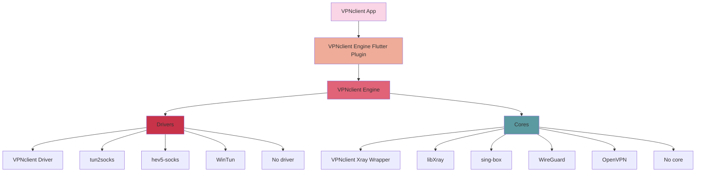

# 🚀 VPN Client Engine (`vpnclient_engine`)

A powerful, cross-platform VPN client engine for ultimate flexibility and performance. 🌐✨

## 🎯 Key Features
- 🌍 **Cross-platform Compatibility**: 🍎iOS, 🤖Android, 🖥️macOS, 🪟Windows, 🐧Linux.
- 🔗 **Multiple Proxy Drivers**: 🚗`vpnclient-driver`, 🧦`tun2socks`, 🛡️`hev-socks5`, 🌪️`wintun`.
- ⚙️ **Flexible Core Wrappers**: `vpnclient-xray` (🌌XRAY) , `libxray` (📚XRAY) , `sing-box` (📦XRAY), `libwg` (🔒WireGuard), `openvpn` (🔐OpenVPN).


## Architecture Overview



## Quick Start

### Prerequisites
- For Android: Android SDK, NDK
- For iOS: Xcode with Swift support
- For Desktop: CMake, platform-specific build tools

### Installation

#### Android (Kotlin)
Add to your `build.gradle`:
```kotlin
dependencies {
    implementation("click.vpnclient:engine:1.0.0")
}
```

#### iOS (Swift)
Add to your `Podfile`:
```ruby
pod 'VPNclientEngine', '~> 1.0.0'
```

#### C++ (Cross-platform)
Add as a subproject or include the prebuilt libraries.

## API Usage

### Common Engine Initialization

#### Swift (iOS/macOS)
```swift
import VPNclientEngine

let engine = VPNClientEngine()
engine.setDriver(type: .vpnclient_driver)
engine.setCore(type: .vpnclient_xray_wrapper)

let config = """
{
    "inbounds": [...],
    "outbounds": [...]
}
"""

engine.start(config: config) { success, error in
    if success {
        print("VPN started successfully")
    } else {
        print("Error starting VPN: \(error?.localizedDescription ?? "Unknown error")")
    }
}
```

#### Kotlin (Android)
```kotlin
import com.vpnclient.engine.VPNClientEngine

val engine = VPNClientEngine()
engine.setDriver(DriverType.VPNCLIENT_DRIVER)
engine.setCore(CoreType.VPNCLIENT_XRAY_WRAPPER)

val config = """
{
    "inbounds": [...],
    "outbounds": [...]
}
""".trimIndent()

engine.start(config) { success, error ->
    if (success) {
        println("VPN started successfully")
    } else {
        println("Error starting VPN: ${error ?: "Unknown error"}")
    }
}
```

#### C++ (Windows/Linux)
```cpp
#include <vpnclient_engine.h>

int main() {
    VPNClientEngine engine;
    engine.setDriver(DriverType::VPNCLIENT_DRIVER);
    engine.setCore(CoreType::VPNCLIENT_XRAY_WRAPPER);
    
    const std::string config = R"({
        "inbounds": [...],
        "outbounds": [...]
    })";
    
    engine.start(config, [](bool success, const std::string& error) {
        if (success) {
            std::cout << "VPN started successfully" << std::endl;
        } else {
            std::cerr << "Error starting VPN: " << error << std::endl;
        }
    });
    
    return 0;
}
```

## API Reference

### Core Methods

1. **setDriver**
   ```swift
   func setDriver(type: DriverType)
   ```
   ```kotlin
   fun setDriver(type: DriverType)
   ```
   ```cpp
   void setDriver(DriverType type);
   ```
   
   Available drivers:
   - VPNCLIENT_DRIVER
   - TUN2SOCKS
   - HEV_SOCKS5
   - WINTUN
   - NONE

2. **setCore**
   ```swift
   func setCore(type: CoreType)
   ```
   ```kotlin
   fun setCore(type: CoreType)
   ```
   ```cpp
   void setCore(CoreType type);
   ```
   
   Available cores:
   - VPNCLIENT_XRAY_WRAPPER
   - LIBXRAY
   - SING_BOX
   - WIREGUARD
   - OPENVPN
   - NONE

3. **start**
   ```swift
   func start(config: String, completion: @escaping (Bool, Error?) -> Void)
   ```
   ```kotlin
   fun start(config: String, callback: (Boolean, String?) -> Unit)
   ```
   ```cpp
   void start(const std::string& config, std::function<void(bool, const std::string&)> callback);
   ```

4. **stop**
   ```swift
   func stop(completion: @escaping (Bool, Error?) -> Void)
   ```
   ```kotlin
   fun stop(callback: (Boolean, String?) -> Unit)
   ```
   ```cpp
   void stop(std::function<void(bool, const std::string&)> callback);
   ```

5. **getStatus**
   ```swift
   func getStatus() -> VPNStatus
   ```
   ```kotlin
   fun getStatus(): VPNStatus
   ```
   ```cpp
   VPNStatus getStatus();
   ```

## Platform-Specific Notes

### Android
- Requires VPN permission:
  ```xml
  <uses-permission android:name="android.permission.INTERNET" />
  <uses-permission android:name="android.permission.FOREGROUND_SERVICE" />
  ```

### iOS
- Add VPN entitlements in your project settings
- Include the following in your Info.plist:
  ```xml
  <key>click.vpnclient.engine</key>
  <array>
      <string>allow-vpn</string>
  </array>
  ```

### Windows
- Requires TUN/TAP drivers installed for some configurations
- Admin privileges may be needed for certain drivers

## Example Configurations

### Xray Core Configuration
```json
{
    "inbounds": [
        {
            "port": 1080,
            "protocol": "socks",
            "settings": {
                "auth": "noauth"
            }
        }
    ],
    "outbounds": [
        {
            "protocol": "vmess",
            "settings": {
                "vnext": [
                    {
                        "address": "your.server.com",
                        "port": 443,
                        "users": [
                            {
                                "id": "your-uuid",
                                "alterId": 0
                            }
                        ]
                    }
                ]
            }
        }
    ]
}
```

### WireGuard Configuration
```json
{
    "interface": {
        "privateKey": "your_private_key",
        "addresses": ["10.0.0.2/32"],
        "dns": ["1.1.1.1"]
    },
    "peer": {
        "publicKey": "server_public_key",
        "endpoint": "your.server.com:51820",
        "allowedIPs": ["0.0.0.0/0"]
    }
}
```
